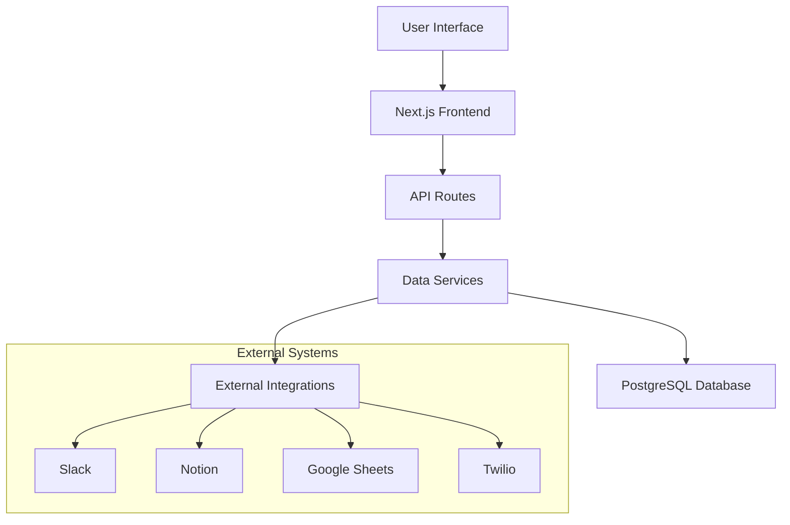
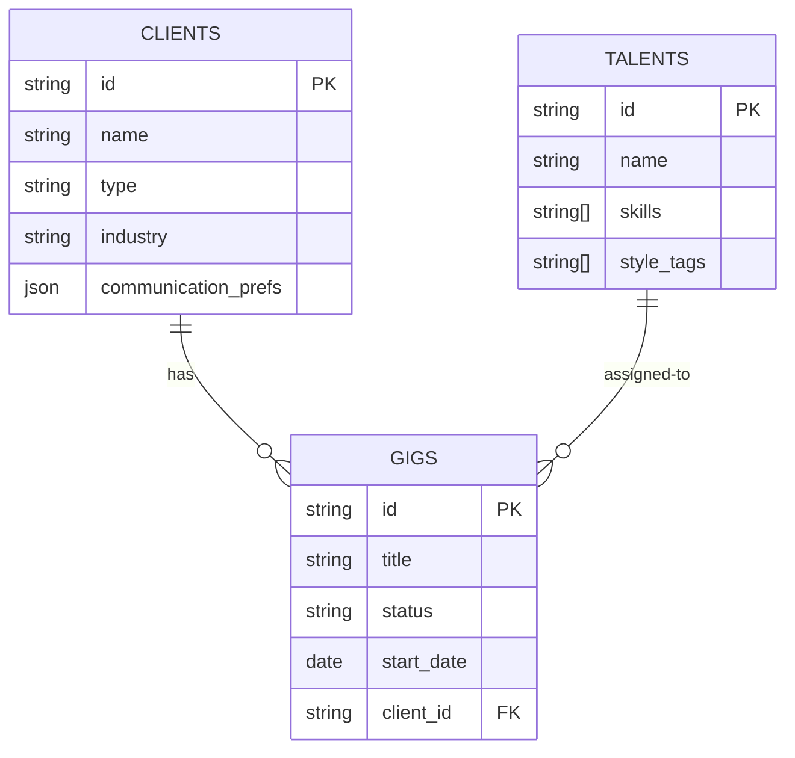
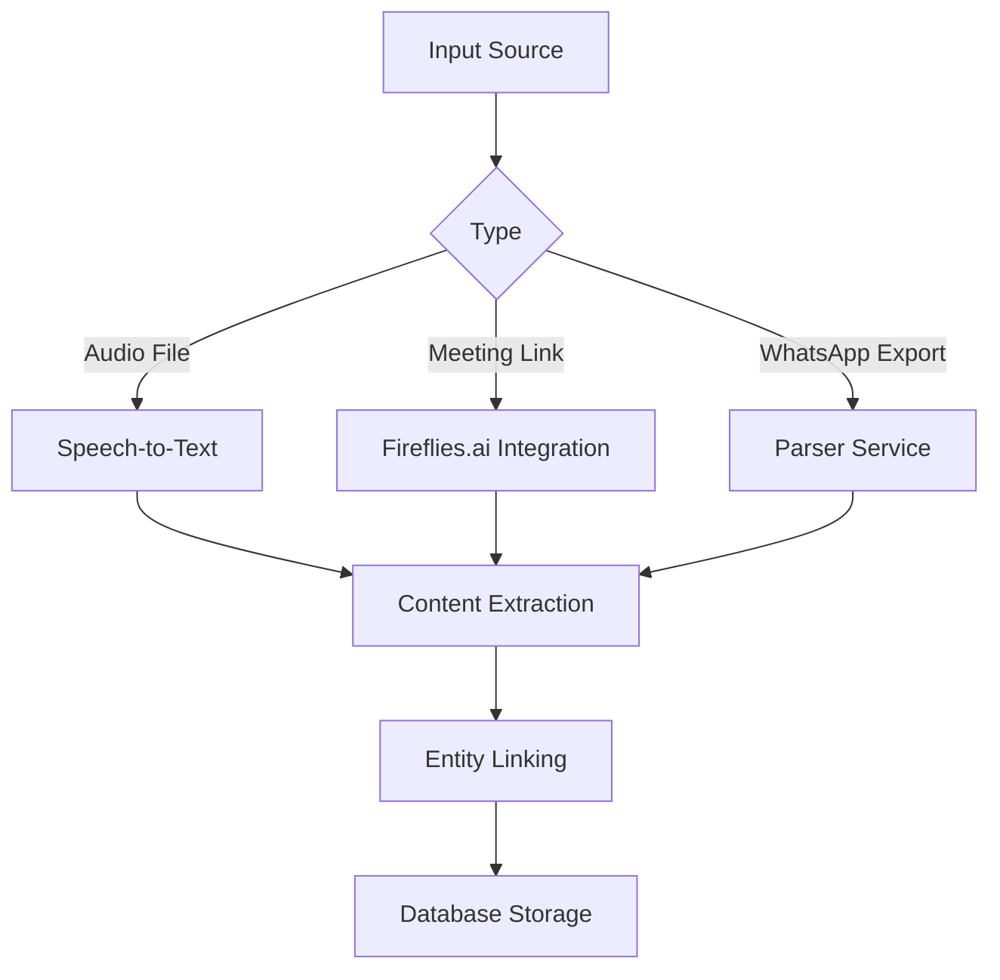
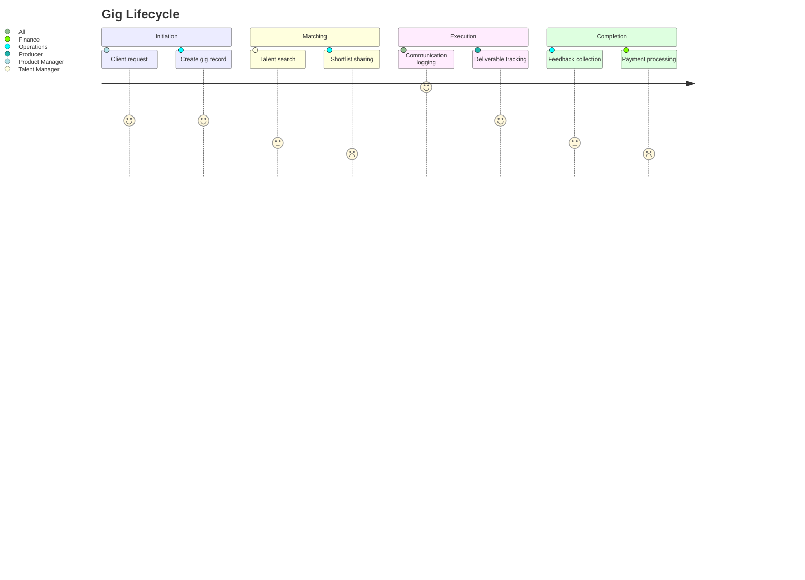
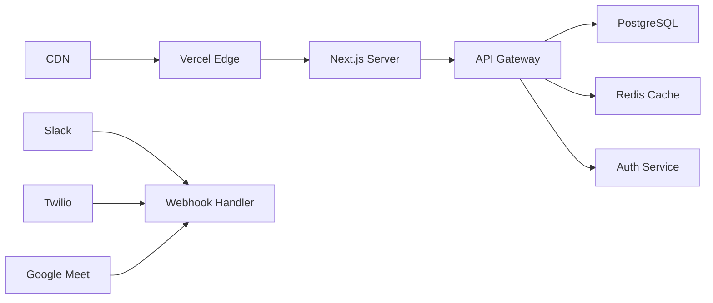

# 📊 CreativeOps – Centralized Ops & Comms System

A unified platform to manage clients, talents, gigs, and communications for creative operations teams.

CreativeOps is a centralized platform designed for creative operations teams to manage clients, talents, gigs, and communications in one place. It streamlines workflows with a CRM, project tracker, and comms hub, reducing information silos. Built with Next.js, it features real-time dashboards, automated workflows, and integrations with Slack, Notion, and Twilio for seamless operational oversight.

---

## Live Demo

[View Live Demo on Vercel](https://operations-management.vercel.app/)

## 🚀 Proposal Overview

### ✅ Selected Modules

- **CRM System** – Unified management of clients, talents, and gigs
- **Project Tracker** – Gig lifecycle and status tracking
- **Comms Hub** – Centralized logging of communications (multi-source)
- **Dashboard** – Real-time operational overview and insights

### 💡 Value Proposition

- 🔽 **40%** reduction in information silos
- ⚡ **30%** faster client–talent matching
- 📚 Centralized audit trail for all operations
- 🤖 Automated workflow triggers

---

## 🏗️ System Architecture



---

## 🧱 Tech Stack

| Category         | Technology                       |
| ---------------- | -------------------------------- |
| Frontend         | Next.js 14, TypeScript           |
| UI Framework     | shadcn/ui, Tailwind CSS          |
| State Management | React Context, Zustand           |
| Data Fetching    | React Query                      |
| Backend          | Next.js API Routes               |
| ORM              | Prisma                           |
| Database         | PostgreSQL                       |
| Auth             | NextAuth.js                      |
| Integrations     | Webhooks (Slack, Notion, Twilio) |
| Monitoring       | Sentry                           |

---

## 📦 Project Structure

```
/app
  /(dashboard)
    /clients/[id]/page.tsx
    /talents/[id]/page.tsx
    /gigs/[id]/page.tsx
    /comms/page.tsx
    page.tsx
  /api
    /clients/route.ts
    /talents/route.ts
    /gigs/route.ts
  /components
    /dashboard
      stats-cards.tsx
      recent-activities.tsx
      upcoming-gigs.tsx
    /clients
      clients-table.tsx
      client-detail.tsx
    /talents
      talents-table.tsx
      talent-detail.tsx
    /gigs
      gigs-table.tsx
      gig-detail.tsx
    /comms
      comms-form.tsx
      comms-history.tsx
    /layout
      sidebar.tsx
      topbar.tsx
  types.ts
  layout.tsx
  page.tsx
```

---

## 📌 Features & Documentation

### 1. 🧠 CRM System

#### ER Diagram



#### Key Capabilities

- Tier-based client segmentation
- Talent availability & style tag filtering
- Style-based matching algorithm
- Embedded client communication preferences

---

### 2. 💬 Comms Hub

#### Communication Model

```ts
interface Communication {
  id: string;
  type: "call" | "note" | "email" | "whatsapp";
  content: string;
  timestamp: DateTime;
  linkedEntity: "client" | "talent" | "gig";
  entityId: string;
  metadata: {
    duration?: number;
    participants?: string[];
    source?: "Zoom" | "Google Meet" | "Upload";
    fileUrl?: string;
  };
}
```

#### Input Pipeline



---

## 🗓️ Roadmap

### 🔹 Phase 1: MVP Launch (2 Weeks)

- ✅ Dockerize application
- ✅ Setup PostgreSQL with Prisma ORM
- ✅ Add NextAuth for authentication
- ✅ Deploy to Vercel
- ✅ Configure Sentry for error tracking

### 🔸 Phase 2: Integrations (1 Week)

- 🔔 Slack notifications via webhook
- 📄 Notion sync for client/talent notes
- 💬 WhatsApp messaging via Twilio

### 🔺 Phase 3: Scalability (Ongoing)

- 🧠 Redis for caching
- ☸️ Kubernetes orchestration
- 🧪 Load testing with k6
- 🪄 Feature flagging with LaunchDarkly

---

## 🎯 Core Objectives

- Reduce creative workflow friction
- Centralize client–talent communications
- Real-time gig visibility for all teams
- Automate operationally repetitive tasks

### 📈 Success Metrics

- ⏱️ 30% reduction in gig setup time
- 🔍 90% of comms searchable < 10s
- 📊 95% gig status accuracy
- ⚙️ 5+ automated workflows per user/week

---

## 🧭 User Workflow



---

## 🔐 Security

### Encryption

- AES-256 encryption at rest
- TLS 1.3 encryption in transit

### Access Control

- Role-based access control (RBAC):  
  _Admin, Ops, TalentManager, Finance_
- Attribute-based access for sensitive fields

### Auditing

- Immutable logs for all data changes
- 90-day log retention policy

---

## 📡 Deployment Architecture



---
